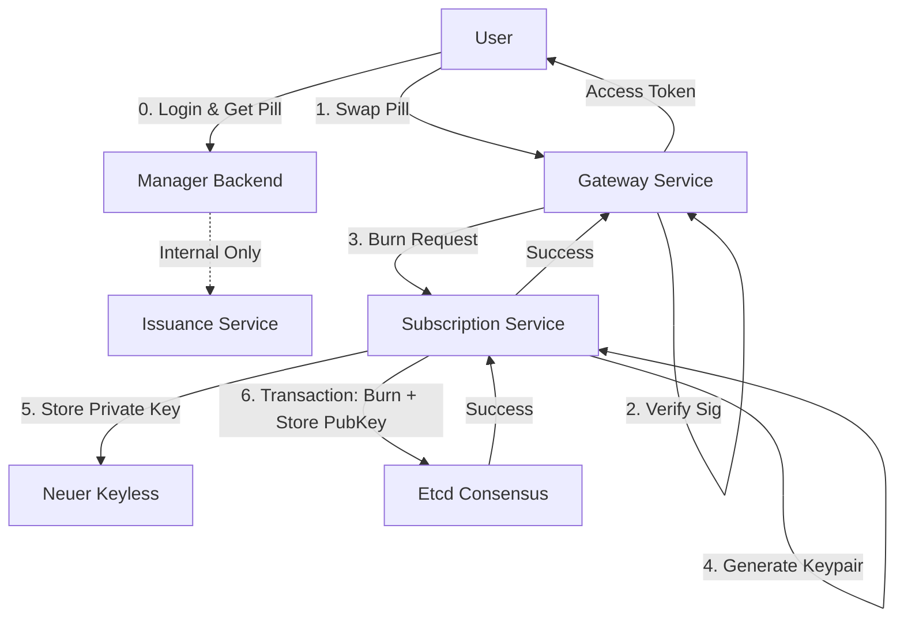

# Entitlement As A Service (EaaS)

This document outlines the architectural pattern of using "Pills" as tradeable, burnable entitlements that provision cryptographic access rights.

## Concept

Crucially, **Entitlement != Access**.
- **Entitlement**: The right to claim a resource (The "Pill").
- **Access**: The cryptographic capability to use the resource (The Key/JWT).

In this system, users trade entitlements (Pills). The transition from Entitlement to Access occurs strictly through a **Burn Event**.

## The Flow

### 1. Issuance (The Mint)
Authority issues a **Pill**: A cryptographically signed payload representing the entitlement.
- **Payload**: `{ "pid": "uuid", "tier": "gold", ... }`
- **Output**: `Base64(Payload).Signature`
- **Status**: Freely tradeable, offline verifiable.

### 2. The Burn (The Swap)
When a user wants to *use* the entitlement, they must exchange the Pill for an access token.
- **Action**: User sends Pill to `Gateway Service`.
- **Validation**: Gateway verifies signature against Authority's public key.
- **Consensus**: Gateway calls `Subscription Service` to burn the pill.
    - **Step 3a (Key Gen)**: `Subscription Service` generates a new Ed25519 Keypair for this specific ID.
    - **Step 3b (Key Storage)**: The **Private Key** is securely stored in `Neuer Keyless` (Crypto-as-a-Service).
    - **Step 3c (Consensus)**: The pill ID is marked as "burnt" in `etcd` (Distributed Consensus). The **Public Key** is stored here as proof.
- **Result**: If successful, the Pill is destroyed (logically), and a short-lived Access Token (JWT) is returned to the user.

### 3. Access (The Usage)
The user now has a JWT (or creates one using the key via Keyless).
- **Action**: User calls `Internal Service` with the JWT.
- **Verification**: Service verifies the JWT using the Public Key (retrieved from `etcd` or derived).

## Architecture Components

## Security Guarantees

1.  **Double Spend Protection**: `etcd` guarantees atomic transactions. A pill cannot be burnt twice.
2.  **Key Isolation**: Private keys are generated *only* upon consumption and stored immediately in a dedicated vault (`neuer-keyless`). They never touch the user's device directly (in this flow) or live in the Gateway's memory longer than needed.
3.  **Separation of Concerns**:
    - **Issuance**: Knows nothing about keys or state.
    - **Subscription**: Manages lifecycle and orchestration.
    - **Keyless**: Dumb vault for secrets.
    - **Etcd**: Source of truth for state.
